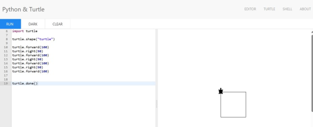
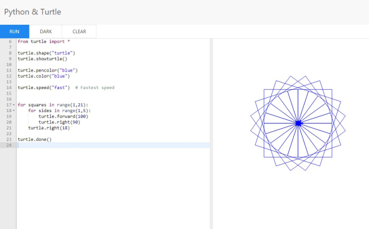
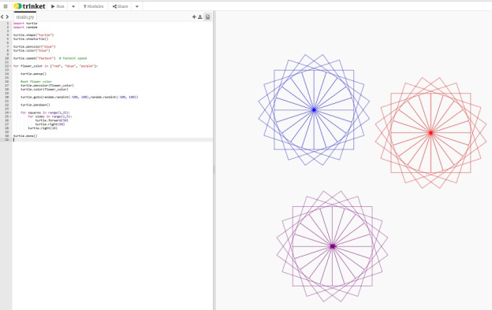
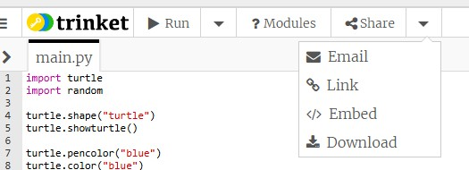
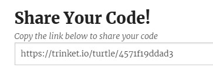

= Learn to Code with Python Turtle Mode: Squares and Flowers
:source-highlighter: highlight.js
:author: @PlanetMaher

== Setup

1. Navigate to <https://trinket.io/turtle>.
2. Delete all the code except for the first line `from turtle import *`
 
image::Images/PythonTutorial-Trinket.svg[trinket.io//turtle]

TIP: Documentation for turtle package is at <https://docs.python.org/3/library/turtle.html>.

== Lesson 1: The Basics

If you're new to programming, you might hear some new things—we're going to define them here for you!
Today, you're going to write your own computer program. A *program* is a set of instructions that tells a computer what to do. There's a lot of different types of programs, from apps on phones to what makes your computer run!
Another word you might hear is *algorithm*. It sounds complicated, but you probably already know what it means. It's just a process—imagine if you had to teach a robot how to braid hair or put on a coat. How would you break it down into smaller pieces?

We might use the term *object-oriented programming* too. This describes how the code works. An object is a package of *methods* (also called operations) and *properties*. 

.Example of Object, Properties and Methods
[%autowidth, %header,cols="m,a, m"]
|===
a| Term 
a| Definition 
a| Example
| Object | A person, place, or thing. |  dog
| Properties | Something that describes the object. | size, color, breed
| Operations/Methods | An action the object can take. | sit, bark, fetch
|===

== Lesson 2: Hello, Turtle

Let's start with a very simple program!

[source, python]
----
import turtle 
turtle.shape("turtle") 
turtle.showturtle() 
turtle.done() 
----

Click the RUN button at the top.  What does it do?

Let's talk about what is going on in our program.

[source, python]
----
import turtle #<.>
turtle.shape("turtle") #<.>
turtle.showturtle() #<.>
turtle.done() #<.>
----
<.> Gets the other code we need to create a Turtle program
<.> Sets the shape property of the character drawing the picture . Other options are: arrow, circle, square, triangle.
<.> Have the turtle show itself!
<.> Tells the interpreter that the turtle is done drawing.

== Lesson 3: Turtle Power!

Let's make that turtle move! Type the following code in Python:

[source, python]
----
turtle.forward(100) #<.>
turtle.right(90) #<.>
turtle.forward(100)
turtle.right(90)
turtle.forward(100)
turtle.right(90)
turtle.forward(100)
----
<.> The `forward()` method moves the turtle forward a certain number of pixels.  The `100` is an argument that tells the `forward()` method how many pixels we want our turtle to move.
<.> The `right()` method rotates the turtle a certain number of degrees to the right.  The `90` is an argument that tells the `right()` method how many degrees we want our turtle to turn.

TIP: To make this go a little faster, you can use copy and paste.  (Ctrl+C and Ctrl+V on Windows.)

Click the RUN button at the top.  What does it do?

.Challenge!
Can you make the turtle move in different directions?  If it can move to the right, can it move to the left?  Can you make your turtle move in the opposite direction of forward?

=== Modify the Turtle
Want to make your square a little different? Here are some things you can try! Where do you think you would put them in the code?

[%header, %autowidth, cols="25a,~a"]
|===
| Property | Code 
| https://docs.python.org/3/library/turtle.html#turtle.pencolor:[Pen Color]
|
[source, python]
----
turtle.pencolor("blue")
----

[source, python]
----
# Use RGB Color picker at <https://rgbcolorpicker.com/> 
# to get HEX value of a specific color.
turtle.pencolor("#ff2b79")
----
| https://docs.python.org/3/library/turtle.html#turtle.color:[Color]
|
[source, python]
----
turtle.fillcolor("blue")
----
|https://docs.python.org/3/library/turtle.html#turtle.speed:[Speed]

(See speed table below.)
|
[source, python]
----
# Fastest speed
turtle.speed(0) 
turtle.speed("fastest")

# Slow speed
turtle.speed(3) 
turtle.speed("slow")
----
| https://docs.python.org/3/library/turtle.html#turtle.bgcolor:[Background Color]
|
[source, python]
----
turtle.bgcolor("green")
----
|===

.Speed word values to numeric values
[%header, %autowidth, cols="m,m"]
|===
| Word | Numeric Values
| fastest | 0
| fast |  10
| normal | 6
| slow | 3
| slowest | 1
|===

== Lesson 4: Loops

A *loop* is a type of programming where you tell the same code to run multiple times. It usually means you have a little less code to write! Today, we will use a `for` loop. There are other kinds of loops too.

=== Create a square
[source,python]
----
for sides in range(1,5):
    turtle.forward(100)
    turtle.right(90)
----
IMPORTANT: Indentation is very important in Python!

Click the RUN button at the top.  What does it do?

You might be wondering what `sides` in `range(1,5)`. The word `sides` is called a variable. A variable is a place where you can store a little piece of information to use in your program. We use this to tell the loop how many times to repeat.
How does it work? This is where the `range(1,5)` comes in.  It creates a list of numbers: `(1,2,3,4)`.  (Range takes inclusive starting number, exclusive ending number.)  Every time it goes through the loop, the `sides` variable is assigned to the value of the next item in the list.  Since there are four items in the list, the code inside the for loop is executed for times. 

.Instructor Note
If the range function is causing confusion, use the following code to demonstrate what is happening.

[source,python]
----
for sides in range(1,5):
    turtle.forward(100)
    turtle.right(90)
    turtle.write(sides)

turtle.hideturtle()
----

== Lesson 5: Loops in Loops in Loops!

You can nest loops in one another—so one loop can run another loop. We're going to use this technique to make a flowers from our squares!

=== Creating a flowers
[source, python]
----
import turtle

turtle.shape("turtle")
turtle.showturtle()

turtle.pencolor("blue")
turtle.color("blue")

turtle.speed("fast")  # Fastest speed

for squares in range(1,21):
    for sides in range(1,5):
        turtle.forward(100)
        turtle.right(90)
    turtle.right(18)
    
turtle.done()
----

Click the RUN button at the top.  What does it do?
 

=== Creating many flowers

.Challenge! 
Try to draw multiple randomly placed flowers.

To move the turtle without drawing a line, use the `penup()`, `goto(x-coordinate, y-coordinate)` and `pendown()` methods. 

[source, python]
----
turtle.penup()
turtle.goto(-50,50)
turtle.pendown()
----
TIP: For the Turtle, `(0,0)` coordinate is in the middle of the screen.  This is unlinke other graphic libaries where `(0,0)` is the upper-left corner of the screen.

To 'randomly' pick a coordinate, you'll need to help from the `random` library.

[source, python]
----
import random
----

To create a random number use `randint` and give the lower and upper bound.
[source, python]
----
import random.randint(-100, 100)
----

.Create 3 colored flowers
[source, python]
----
import turtle 
import random

turtle.shape("turtle")
turtle.showturtle()

turtle.pencolor("blue")
turtle.color("blue")

turtle.speed("fastest")  # Fastest speed

for flower_color in ["red", "blue", "purple"]: #<.>

    turtle.penup()
    
    #set flower color
    turtle.pencolor(flower_color)
    turtle.color(flower_color)

    #move the turtle to new center location for flower
    turtle.goto(random.randint(-100, 100),random.randint(-100, 100))
    
    turtle.pendown()
    
    for squares in range(1,21): #<.>
        for sides in range(1,5): #<.>
            turtle.forward(50)
            turtle.right(90)
        turtle.right(18)
    
turtle.done()
----
<.> The first loop determines how many flower blossoms we're going to make and what color they will be.
<.> The next loop creates 20 squares to creat a flower.
<.> This loop creates the individual squares

Click the RUN button at the top.  What does it do?

== Lesson 6: Share your code!

You can share your code! You can download the file for later or create a link to share.  

Link will be in the format `https://trinket.io/turtle/{code}`

 
TIP: _Instructor note!_  Students love sharing what they created.  Ask for teachers help to get the link code so you can show some of the students work.

== Lesson 7: Learn from others!

A great way to learn programming is to see what others have done.

Try the code from https://pythondex.com/draw-lion-in-python and see what it does.  

WARNING: Don't forget to save your own code in a file first!

== Appendix: Alternate Python turtle sites

<https://trinket.io/turtle> is the best site for programming with the Python turtle.

The following sites also provide an online interpreter that supports the Turtle module.  However, these sites don't support the full turtle library.

* <https://pythonandturtle.com/turtle/>
* <https://python.fhgr.ch/turtle.html>
* <https://pythonsandbox.com/turtle>
* <https://pythondex.com/python-turtle-compiler>
