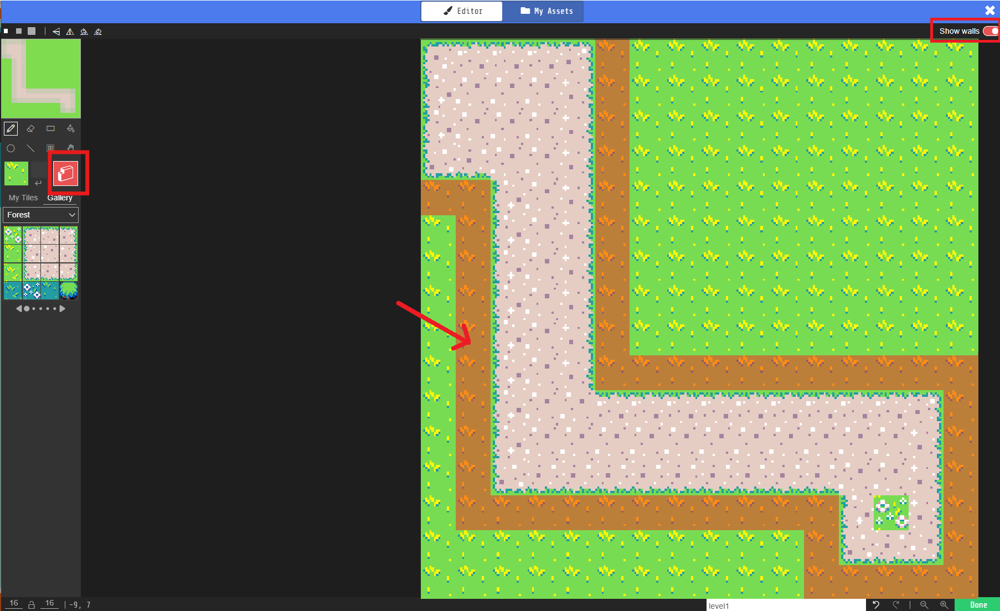

= Learn to Code with MakeCode Arcade!
:source-highlighter: highlight.js

== Setup

. Navigate to <https://arcade.makecode.com/>
. https://arcade.makecode.com/identity/sign-in[Sign-in], if possible. +
This step is not required.  If you do login your code will be automatic. Log in using your https://account.microsoft.com/account[Microsoft Account], https://support.google.com/accounts/answer/14152768[Google Account] or by using https://support.clever.com/hc/s/articles/360026162691?language=en_US[Clever].
. Create a new project.
. The MakeCode Editor will look like the image below.
+
image::Images/MakeCode-Editor.png[]

. Change the code editor to *Python*. 

== Lesson 1: The Basics 

TIP: Pro-Tip: BE LAZY! Start typing and hit tab or enter to complete the code. Use the up and down arrow buttons to scroll through the methods. 

If you're new to programming, you might hear some new things—we're going to define them here for you!

Today, you're going to write your own computer program. A *program* is a set of instructions that tells a computer what to do. There's a lot of different types of programs, from apps on phones to what makes your computer run!

Another word you might hear is *algorithm*. It sounds complicated, but you probably already know what it means. It's just a process—imagine if you had to teach a robot how to braid hair or put on a coat. How would you break it down into smaller pieces?

We might also use the term *object-oriented programming*. This describes how the code works. An object is a package of *methods* and *properties*. 

.Example of Object, Properties and Methods
[%autowidth, %header,cols="m,a, m"]
|===
a| Term 
a| Definition 
a| Example
| Object | A person, place, or thing. |  dog
| Properties | Something that describes the object. | size, color, breed
| Methods | An action the object can take. | sit, bark, fetch
| Variable | An instance of an object. | 'Fido' is a specific dog. |
|===

== Lesson 2: Creating a Player

To create a player in our game, we need to create a player object.  Remember, we need to create a variable to keep track of our player object.  

[source, python]
----
dash_the_duck = sprites.create(img(""" """)) <.><.>
----
<.> `dash_the_duck` is the name of our variable.  We will use this again.
<.> `sprites.create` is a method we use to create the player object. More on that later.

Before we move on, lets design our player. Select the art icon to the left of the code you just created.  

Use the Image Editor to create your player.  You can draw an icon by hand or you can select *Gallery* and choose an image.  Set the *Asset* name to *dash_the_duck_picture* and select *Done* when you are finished to return to the code editor.

In game programming, _sprite_ is the generic term for a player or enemy object that interacts with other pieces of the game like maze walls, other players, or enemies.  Each type of sprite has its own set of abilities.  In our case, Dash the Duck is a player.

[source, python]
----
dash_the_duck.set_kind(SpriteKind.player) <.>
----
<.> `set_kind` sets the player type/kind property for our sprite.

Lastly, we need to set the starting position of our player.

[source, python]
----
dash_the_duck.set_position(10, 10) <.>
----
<.> `set_position` set the x,y position property for our sprite. `0,0` is the upper left of the screen.

Our code now looks something like:
[source, python]
----
dash_the_duck = sprites.create(assets.image("""dash_the_duck_picture""")) <.>
dash_the_duck.set_kind(SpriteKind.player)
dash_the_duck.set_position(10, 10)
----
<.> The text in the string should match the name of the asset we created earlier.

== Lesson 3: Creating a Maze

Let's start by making our maze.

. First, we need to create our maze object
+
[source, python]
----
tiles.set_tilemap(tilemap(""" """)) <.>
----
<.> `tiles` is a variable that MakeCode created for us.  It's for tracking on the tiles of a map.

. Click the gray map icone to the left of the code.
+

. When the image editor opens, use the tiles to create a maze. If you use the 'Forest' tiles, any tile with dirt is part of the path. Tiles with greenary will be used to form the walls. If you have time, you can use the all green tiles to fill in the extra space.
+
image::Images/Maze/MakeCode-Maze-TileMap-Background.png[]

. Use the *Draw Walls* tools to tell the game where the walls are for the maze. The walls will show as semi-transparent red blocks in the image editor.
+

. Name the image *level1*.
. Select *Done*.

Our code now looks something like:
[source, python]
----
dash_the_duck = sprites.create(assets.image("""dash_the_duck_picture"""))
dash_the_duck.set_kind(SpriteKind.player)
dash_the_duck.set_position(10, 10)

tiles.set_current_tilemap(tilemap("""level0"""))
----

=== References
* https://arcade.makecode.com/docs[MakeCode Arcade Documentation].
* https://arcade.makecode.com/tutorials/maze[Maze Tutorial].

== Lesson 3: 