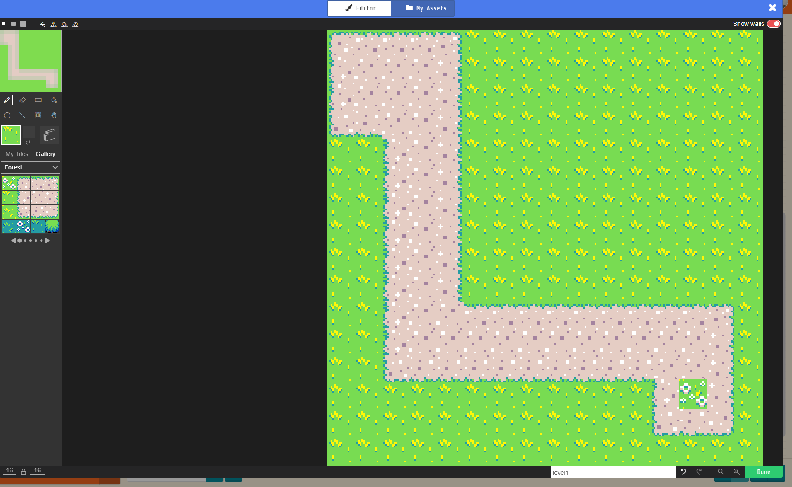
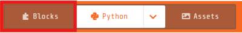

= Learn to Code with MakeCode Arcade!
:source-highlighter: highlight.js

== Setup

. Navigate to <https://arcade.makecode.com/>
. https://arcade.makecode.com/identity/sign-in[Sign-in], if possible. +
This step is not required.  If you do login your code will be automatically saved. Log in using your https://account.microsoft.com/account[Microsoft Account], https://support.google.com/accounts/answer/14152768[Google Account] or by using https://support.clever.com/hc/s/articles/360026162691?language=en_US[Clever].
. Create a new project.
. The MakeCode Editor will look like the image below.
+
image::Images/MakeCode-Editor.png[]

. Change the code editor to *Python*. 

== Lesson 1: The Basics 

TIP: Pro-Tip: BE LAZY! Start typing and hit tab or enter to complete the code. Use the up and down arrow buttons to scroll through the methods. 

If you're new to programming, you might hear some new things—we're going to define them here for you!

Today, you're going to write your own computer program. A *program* is a set of instructions that tells a computer what to do. There's a lot of different types of programs, from apps on phones to what makes your computer run!

Another word you might hear is *algorithm*. It sounds complicated, but you probably already know what it means. It's just a process—imagine if you had to teach a robot how to braid hair or put on a coat. How would you break it down into smaller pieces?

Game programming is a type of *object-oriented programming*.  In game programming, we create *objects* and give them *properties*.  We also give them *methods*.

.Example of Object, Properties and Methods
[%autowidth, %header,cols="m,a, m"]
|===
a| Term 
a| Definition 
a| Example
| Object | A person, place, or thing. |  dog
| Properties | Something that describes the object. | size, color, breed
| Methods | An action the object can take. | sit, bark, fetch
| Variable | An instance of an object. | 'Fido' is a specific dog. 
|===

We can also create *events* that *trigger* when something happens in the game (like Dash the Duck reaching the end of the maze).

.Example of Object, Properties and Methods
[%autowidth, %header,cols="m,a, m"]
|===
a| Term 
a| Definition 
a| Example
| Event | An event in programming refers to an action or occurrence recognized by software. | A car drives by and causes the dog to bark. 
| Trigger | A trigger is a specific event that causes something to happen. | A car driving by.
| Function | A function is a block of code that performs a specific task. Functions are not attached to objects, but often use objects as parameter. | A set of code that makes the dog bark then chase after the car that is driving by.
| Parameter | A parameter is a extra information that is passed to a function or method. | The item a dog retrieves when it fetches.
|===

== Lesson 2: Creating a Player

To create a player in our game, we need to create a player object.  Remember, we need to create a variable to keep track of our player object.  

[source, python]
----
dash_the_duck = sprites.create(img(""" """)) <.><.>
----
<.> `dash_the_duck` is the name of our variable.  We will use this again.
<.> `sprites.create` is a method we use to create the player object. More on that later.

Before we move on, lets design our player. Select the art icon to the left of the code you just created.  

image::Images/Maze/MakeCode-Maze-CreatePlayer.png[]

Use the Image Editor to create your player.  You can draw an icon by hand or you can select *Gallery* and choose an image.  Set the *Asset* name to *dash_the_duck_picture* and select *Done* when you are finished to return to the code editor.

In game programming, _sprite_ is the generic term for a player or enemy object that interacts with other pieces of the game like maze walls, other players, or enemies.  Each type of sprite has its own set of abilities.  In our case, Dash the Duck is a player.

[source, python]
----
dash_the_duck.set_kind(SpriteKind.player) <.>
----
<.> `set_kind` sets the player type/kind property for our sprite.

We need to set the starting position of our player.

[source, python]
----
dash_the_duck.set_position(10, 10) <.>
----
<.> `set_position` sets the x,y position property for our sprite. `0,0` is the upper left of the screen.

Lastly, we need to tell the controller to move our player.  This is done using a method on the controller object.

[source, python]
----
controller.move_sprite(dash_the_duck, 100, 100) <.>
----
<.> `move_sprite` tells the `controller` object to move `dash_the_duck` at a speed of `100` horizontally and `100` vertically.

Our code now looks something like:
[source, python]
----
dash_the_duck = sprites.create(assets.image("""dash_the_duck_picture""")) <.>
dash_the_duck.set_kind(SpriteKind.player)
dash_the_duck.set_position(10, 10)
controller.move_sprite(dash_the_duck, 100, 100)
----
<.> The text in the string should match the name of the asset we created earlier.

=== Give it a Try!

. Click the *Play* button to run your code. You should see Dash the Duck on the screen. Unfortunately, Dash won't move yet.  That's because we haven't set the maze yet.

== Lesson 3: Creating a Maze

Let's start by making our maze.

. First, we need to create our maze object
+
[source, python]
----
tiles.set_tilemap(tilemap(""" """)) <.>
----
<.> `tiles` is a variable that MakeCode created for us.  It's for tracking of the tiles of a map.

. Click the gray map icone to the left of the code.
+
image::Images/Maze/MakeCode-Maze-TileMap-CreateStatement.png[]

. When the image editor opens, use the tiles to create a maze. If you use the 'Forest' tiles, any tile with dirt is part of the path. Tiles with greenary will be used to form the walls. If you have time, you can use the all green tiles to fill in the extra space. Try using the *Fill* tool to fill in the empty space.

. Don't forget to add something at the end of the maze so Dash has something to look forward to!  This maze has a nice patch of flowers at the end.
+

+
IMPORTANT: The prize at the end of the maze must be a different type of tile than all other tiles in the maze.  This is important because we will use this tile to detect when Dash has reached the end of the maze.

. Use the *Draw Walls* tools to tell the game where the walls are for the maze. The walls will show as semi-transparent red blocks in the image editor. Dash won't be able to move through the walls.
+
image::Images/Maze/MakeCode-Maze-TileMap-Walls.png[]

. Name the image *level0*.
. Select *Done*.

Our code now looks something like:
[source, python]
----
dash_the_duck = sprites.create(assets.image("""dash_the_duck_picture"""))
dash_the_duck.set_kind(SpriteKind.player)
dash_the_duck.set_position(10, 10)
controller.move_sprite(dash_the_duck, 100, 100)

tiles.set_current_tilemap(tilemap("""level0"""))
----

=== Give it a Try!

. Click the *Play* button to run your code. Dash should be in the maze. Use the arrow keys to move Dash around the maze.  You'll notice that dash can't move through the walls.  This is because we set the walls in the maze using the *Draw Walls* tool when we created the maze.

Did you notice that Dash can move off the screen?  Let's fix that now by telling the scene to follow the duck as it moves through the scene. The *scene* is the variable that tracks what is displayed on the controller.

[source, python]
----
scene.camera_follow_sprite(dash_the_duck) <.>
----
<.> `camera_follow_sprite` tells the camera for the scene (i.e. the maze scene we just created) to always show `dash_the_duck`.

Our Code now looks like:

[source, python]
----
dash_the_duck = sprites.create(assets.image("""
    dash_the_duck_picture
"""))
dash_the_duck.set_kind(SpriteKind.player)
dash_the_duck.set_position(10, 10)
controller.move_sprite(dash_the_duck, 100, 100)
scene.camera_follow_sprite(dash_the_duck)

tiles.set_current_tilemap(tilemap("""level0"""))
----

Dash can now move throught the maze!

== Lesson 3: Detecting Overlaps

We need to tell the game to detect when Dash the Duck reaches the end of the maze.  We will do this by checking if Dash overlaps with the tile at the end of the maze.  We will need to use an event called `on_overlap_tile`.  

An event needs to be told what function to call when the event is triggered. So, we will also need to create a function.  A function is a block of code that performs a specific task.  

The syntax for creating a function and hooking it up to an event is a little tricky, so let's use the block editor to help us.  We will convert the block code to Python code later.

To switch to the block editor, click on the *Blocks* button on the top of the code editor. 

From the *Scene* category, choose **"on `sprite` of kind `player` overlaps `type of tile` at `location` "**.

Choose the type of tile that you selected for the end of the maze.  In this case, it was a flower tile.  

Now, let's switch back to the Python code editor to see what code was created.  Click on the *Python* button at the top of the code editor.

The newly created code for the event should look something like:

[source, python]
----
def on_overlap_tile(sprite, location): <.>
    pass <.>
scene.on_overlap_tile( <.>
    SpriteKind.player,
    sprites.castle.tile_grass2,
    on_overlap_tile)
----
<.> The `def` keyword is how functions are defined in python.  This function is called `on_overlap_tile`. It's common, but a little confusing, to have the event name match the name function that is called when the event is triggered.  However, you can name the function what ever you want.  The function takes two parameters: `sprite` and `location`.  The `sprite` parameter is the player sprite (i.e. `dash_the_duck`) and the `location` is coordinates of the tile that was overlapped.  
<.> Right now our function does nothing. The `pass` statement is a placeholder for code that we will add later.
<.> `scene.on_overlap_tile` is the event that tells the game to call the `on_overlap_tile` function when the player sprite overlaps with the tile type we selected for the end of the maze.  
- The `SpriteKind.player` parameter tells the game to only call this function when a player sprite overlaps with the tile type.
- The `sprites.castle.tile_grass2` parameter is the tile type that we selected for the end of the maze.  This is the tile that will trigger the event.
- The `on_overlap_tile` the name of function that will be called when the event is triggered.

If having the the function and event named the same thing is confusing, you can change the function name to something else.  For example, you could change the function name to `on_end_of_maze`.  Just make sure to change the function name in both places.
[source, python]
----
def on_end_of_maze(sprite, location): 
    pass 
scene.on_overlap_tile( 
    SpriteKind.player,
    sprites.castle.tile_grass2,
    on_end_of_maze) 
----

NOTE: If you switch back to the block editor, then back to the Python editor again, you will see MakeCode renames the function back to the original name.

Whew, that was a lot of new information!  We only have one more thing to do before we can run our code. We need to tell the program that the game is over and we won. 

[source, python]
----
def on_overlap_tile(sprite, location):
    game.set_game_over_effect(True, effects.confetti) <.>
    game.set_game_over_message(True, "GAME OVER!") <.>
    game.game_over(True) <.>
----
<.> `game.set_game_over_effect` sets the `game over effect` property to `confetti`.
<.> `game.set_game_over_message` sets the `game over message` property to `GAME OVER!`.
<.> `game.game_over` tells the game that the game is over.  The `True` parameter tells the game we won. If we lost, we would set this to `False`.

Final code should look something like this:

[source, python]
----
def on_overlap_tile(sprite, location):
    game.set_game_over_effect(True, effects.confetti)
    game.set_game_over_message(True, "GAME OVER!")
    game.game_over(True)
scene.on_overlap_tile(SpriteKind.player,
    sprites.castle.tile_grass2,
    on_overlap_tile)

dash_the_duck = sprites.create(assets.image("""
    dash_the_duck_picture
"""), 0)
dash_the_duck.set_kind(SpriteKind.player)
dash_the_duck.set_position(10, 10)
controller.move_sprite(dash_the_duck, 100, 100)
scene.camera_follow_sprite(dash_the_duck)
tiles.set_current_tilemap(tilemap("""
    level0
"""))
----

That's it!  We are ready to run our code.  Click the *Play* button to run your code.  Use the arrow keys to move Dash the Duck through the maze.  When you reach the end of the maze, you should see confetti and a message that says "GAME OVER!"

Press the *A* button to restart the game. 

== Lesson 4: Share your code! 

include::sections/share_your_code.adoc[]

== Lesson 5: Learn from others! 

include::sections/learn_from_others.adoc[]

== References
* https://arcade.makecode.com/docs[MakeCode Arcade Documentation]
* https://arcade.makecode.com/tutorials/maze[Maze Tutorial]
** This tutorial is based on the maze tutorial.

=== Method References
* Sprites
** https://arcade.makecode.com/reference/sprites/create[Sprites.create]
https://arcade.makecode.com/reference/sprites/sprite/set-kind[Sprites.set_kind]
** https://arcade.makecode.com/reference/sprites/sprite/set-position[Sprites.set_position]
** https://arcade.makecode.com/reference/controller/move-sprite[Controller.move_sprite]
* Controller
** https://arcade.makecode.com/reference/controller/move-sprite[Controller.move_sprite]
* Scene and Tiles
** https://arcade.makecode.com/reference/scene/camera-follow-sprite[Scene.camera_follow_sprite]
** https://arcade.makecode.com/reference/scene/on-overlap-tile[Scene.on_overlap_tile]
** https://arcade.makecode.com/reference/tiles/set-tilemap[Tiles.set_tilemap]
* Game
** https://arcade.makecode.com/reference/game/over[Game.game_over]
** https://arcade.makecode.com/reference/game/set-game-over-effect[Game.set_game_over_effect]
** https://arcade.makecode.com/reference/game/set-game-over-message[Game.set_game_over_message]