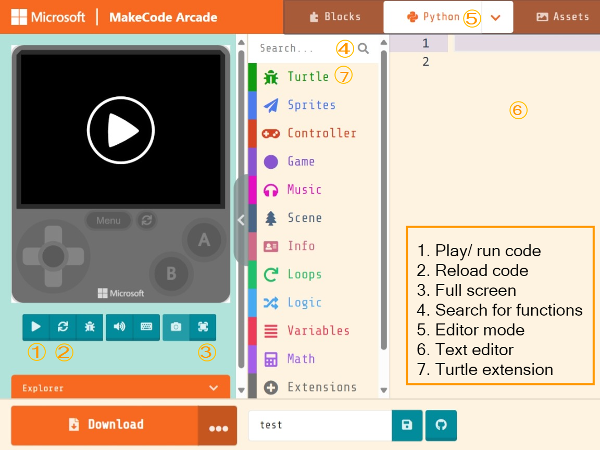
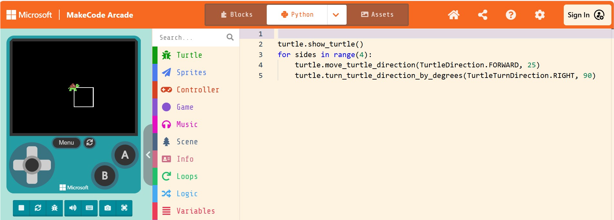
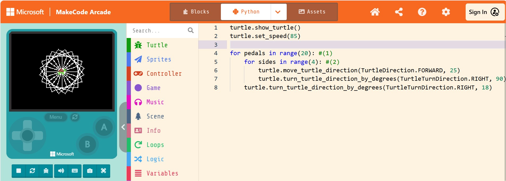

= Learn to Code with MakeCode Arcade!
:source-highlighter: highlight.js

== Setup

. Navigate to <https://arcade.makecode.com/>
. https://arcade.makecode.com/identity/sign-in[Sign-in], if possible. +
This step is not required.  If you do login your code will be automatic. Log in using your https://account.microsoft.com/account[Microsoft Account], https://support.google.com/accounts/answer/14152768[Google Account] or by using https://support.clever.com/hc/s/articles/360026162691?language=en_US[Clever].
. Create a new project.
. Set the editor to 'Python'mode.
. Add the 'Turtle' Extension
    .. Select '+ Extensions' button.
    .. Search for `turtle`
    .. Select the `turtle-logo` extension

.MakeCode Arcade editor with `turtle-logo` extension

== Lesson 1: The Basics 

TIP: Pro-Tip: BE LAZY! Start typing and hit tab or enter to complete the code. Use the up and down arrow buttons to scroll through the methods. 

If you're new to programming, you might hear some new things—we're going to define them here for you!

Today, you're going to write your own computer program. A *program* is a set of instructions that tells a computer what to do. There's a lot of different types of programs, from apps on phones to what makes your computer run!

Another word you might hear is *algorithm*. It sounds complicated, but you probably already know what it means. It's just a process—imagine if you had to teach a robot how to braid hair or put on a coat. How would you break it down into smaller pieces?

We might also use the term *object-oriented programming*. This describes how the code works. An object is a package of *methods* and *properties*. 

.Example of Object, Properties and Methods
[%autowidth, %header,cols="m,a, m"]
|===
a| Term 
a| Definition 
a| Example
| Object | A person, place, or thing. |  dog
| Properties | Something that describes the object. | size, color, breed
| Methods | An action the object can take. | sit, bark, fetch
|===

== Lesson 2: Hello, Turtle

Let's start with a very simple program!

[source, python]
----
turtle.show_turtle()
----

Click the  button.  What does it do? 

== Lesson 3: Turtle Power!

Let's make that turtle move! 

NOTE: Don't be intimidated by the length of the code below. Python programmers like to use descriptive names for their methods.  A method named `jump()` in one programming language is named `jump_as_high_as_possible()` in Python.

Type the following code in Python:

[source, python]
----
turtle.move_turtle_direction(TurtleDirection.FORWARD, 25) #<.>
turtle.turn_turtle_direction_by_degrees(TurtleTurnDirection.RIGHT, 90) #<.>
turtle.move_turtle_direction(TurtleDirection.FORWARD, 25)
turtle.turn_turtle_direction_by_degrees(TurtleTurnDirection.RIGHT, 90)
turtle.move_turtle_direction(TurtleDirection.FORWARD, 25)
turtle.turn_turtle_direction_by_degrees(TurtleTurnDirection.RIGHT, 90)
turtle.move_turtle_direction(TurtleDirection.FORWARD, 25)
turtle.turn_turtle_direction_by_degrees(TurtleTurnDirection.RIGHT, 90)
----
<.> The `move_turtle_direction()` method moves the turtle forward a certain number of pixels. The `TurtleDirection.FORWARD` is an argument that tells the `move_turtle_direction()` which direction to move the turtle. The `25` is an argument that tells the `move_turtle_direction()` method how many pixels we want our turtle to move.
<.> The `turn_turtle_direction_by_degrees()` method rotates the turtle a certain number of degrees. `TurtleTurnDirection.RIGHT` tells the method we want the turtle to turn to the right.  The `90` is an argument that tells the `turn_turtle_direction_by_degrees()` method how many degrees we want our turtle to turn.

TIP: To make this go a little faster, you can use copy and paste.  (Ctrl+C and Ctrl+V on Windows.) 

Click the  button.  What does it do? 
 
====
.Challenge!
Can you make the turtle move in different directions?  If it can move to the right, can it move to the left?  Can you make your turtle move in the opposite direction of forward?
====

There are other actions your turtle can perform.

.Actions your turtle can perform
[%header, %autowidth, cols="30a,~a"]
|===
| Action | Code 
| Talk
|
[source, python]
----
turtle.say("Hello, World!")
----

|Erase previously drawn lines.
|
[source, python]
----
turtle.clear_screen() 
----
| Move turtle to specific location
|
[source, python]
----
# First number is x-coordinate between -80 and 80.
# Second number is y-coordinate between -80 to 80
turtle.set_position_cartesian(10, 10)
----
| Move turtle to the center of screen
|
[source, python]
----
# Same as turtle.set_position_cartesian(0, 0)
turtle.home()
----
| Start/stop drawing lines.
|
[source, python]
----
# Pull the pen up so when turtle moves no lines are drawn.
turtle.pen(TurtlePenMode.UP)

# Pull the pen down so when turtle moves no lines are drawn.
turtle.pen(TurtlePenMode.DOWN)
----
| Turn turtle.
|
[source, python]
----
# Turn right 90 degrees
turtle.turn_turtle_direction_by_degrees(TurtleTurnDirection.RIGHT, 90)

# Turn left in a full circle
turtle.turn_turtle_direction_by_degrees(TurtleTurnDirection.LEFT, 360)
----
| Move turtle.
|
[source, python]
----
# Move turtle forward 25 pixels
turtle.move_turtle_direction(TurtleDirection.FORWARD, 25)

# Move turtle backward 10 pixels
turtle.move_turtle_direction(TurtleDirection.FORWARD, 10)
----
|===

=== Modify the Turtle

Want to make your square a little different? Here are some things you can try! Where do you think you would put the method calls in the code?

[%header, %autowidth, cols="25a,~a"]
|===
| Property | Code 
| https://arcade.makecode.com/developer/images[Pen Color]
|
[source, python]
----
# Color can be number from 0 to 15.
# 0 is white, 15 is black
# Try out numbers 1-14.  What colors do you get?
turtle.set_pen_color(1)
----

|Speed
|
[source, python]
----
# Fastest speed
turtle.speed(100) 

# Slow speed
turtle.speed(1) 
----
| Background Color
|
[source, python]
----
# Color can be number from 0 to 15.
scene.set_background_color(0)
----
NOTE: Did you notice that background color is part of the `scene` object and not the `turtle` object?
|===

== Lesson 4: Loops 

A *loop* is a type of programming where you tell the same code to run multiple times. It usually means you have a little less code to write! Today, we will use a `for` loop. There are other kinds of loops, too.

=== Create a square
Type the following code in your text editor.  Don't forget to remove the old repeated code.

[source,python]
----
turtle.show_turtle()
for sides in range(4):
    turtle.move_turtle_direction(TurtleDirection.FORWARD, 25)
    turtle.turn_turtle_direction_by_degrees(TurtleTurnDirection.RIGHT, 90)
----
IMPORTANT: Indentation is very important in Python!

Click the  button.  What does it do? 

You might be wondering what is `sides` in `range(4)`. The word `sides` is called a variable. A variable is a place where you can store a little piece of information to use in your program. We use this to tell the loop how many times to repeat.

How does it work? This is where the `range(4)` comes in.  It creates a list of numbers: `(0,1,2,3)`.  (Programmers like zero-based lists, which is why the list is 0-3 and not 1-4.)  Every time it goes through the loop, the `sides` variable is assigned to the value of the next item in the list.  Since there are four items in the list, the code inside the `for` loop is executed four times. 

Click the  button.  What does it do? 

One way to see the effect of each loop this is to make a slight change to the code above.  Did you know you can choose a random pen color?  Let's try that. Remember colors are defined in MakeCode Arcade by integers (whole numbers) from 0 to 15. Let's update the code: 

[source,python]
----
turtle.show_turtle()
for sides in range(4):
    turtle.set_pen_color(randint(0, 14)) #<.>
    turtle.move_turtle_direction(TurtleDirection.FORWARD, 25) 
    turtle.turn_turtle_direction_by_degrees(TurtleTurnDirection.RIGHT, 90)
----
<.> `randint()` is a function that will return a random whole number a between the start and end numbers (inclusive). We have asked for a random number between 0 and 14.  Black (15) is not included to avoid the appearance of a disappearing line.

Try again! Click the  button.  What does it do? 

== Lesson 5: Loops in Loops in Loops!

You can nest loops in one another—so one loop can run another loop. We're going to use this technique to make flowers from our squares!

=== Creating a single flower
[source, python]
----
turtle.show_turtle()
turtle.set_speed(85)

for pedals in range(20): #<.>
    for sides in range(4): #<.>
        turtle.move_turtle_direction(TurtleDirection.FORWARD, 25)
        turtle.turn_turtle_direction_by_degrees(TurtleTurnDirection.RIGHT, 90)
    turtle.turn_turtle_direction_by_degrees(TurtleTurnDirection.RIGHT, 18)
----
<.> This loop determines how many flower pedals we're going to make. 
<.> This loop determines how many sides each pedal has. Our flower is made of square-shaped pedals.

Click the  button.  What does it do?

====
.Challenge!
* Where would you put code to change the color of each side of the pedal? 
* Can you make the pedals a different shape?  
* Can you increase the number of pedals?

TIP: The number of `sides` or `pedals` multiplied by the degrees specified in `turn_turtle_direction_by_degrees` must equal 360.
====

=== Creating many flowers

Let's to draw multiple randomly placed flowers. To move the turtle without drawing a line, use `turtle.pen()` and `turtle.set_position_cartesian()` methods. 

[source, python]
----
turtle.show_turtle()
turtle.set_speed(100)

for flowers in range(3):
    turtle.pen(TurtlePenMode.UP) #<.>
    turtle.set_pen_color(randint(0, 14)) #<.>
    turtle.set_position_cartesian(randint(-35, 35), randint(-35, 35)) #<.>
    turtle.pen(TurtlePenMode.DOWN) #<.>
    for pedals in range(20):
        for sides in range(4):
            turtle.move_turtle_direction(TurtleDirection.FORWARD, 20) #<.>
            turtle.turn_turtle_direction_by_degrees(TurtleTurnDirection.RIGHT, 90)
        turtle.turn_turtle_direction_by_degrees(TurtleTurnDirection.RIGHT, 18)
----
<.> Turtle will not draw lines when it moves.
<.> Set pen color to random color.
<.> Move turtle to random location.  We are using the range -35 to 35 instead of -80 to 80 because we want the entire flower to fit on the screen.
<.> Tell the turtle to draw lines when it moves.
<.> The side of each pedal is now 20 pixels long instead of 25 so the flowers fit on the screen better.

== Lesson 6: Share your code! 

In MakeCode, you can https://arcade.makecode.com/share[share your program] so that other people that use MakeCode Arcade can look at the code, run it and edit it. 

On the top right, click the image:https://pxt.azureedge.net/blob/2e7e8fe72efed3ff7a9d33f0bfb142898b5bce7c/static/share/share-icon.png[30,30,title="Share"] icon.

Give your project a title.

image::https://pxt.azureedge.net/blob/abd9a0f7df3bd4da6e999222d5aeb8874508f3a1/static/share/share-project.png[]

Clicking "Share Project" will create a link to your project. The link will be in the format `https://makecode.com/{code}`

image::https://pxt.azureedge.net/blob/6e0bad39fe9657c51ec93e5bd0344c93c71d0100/static/share/anon-share-link.png[]

These links are snapshots in time of a project. If you are signed in, you will have the option of creating a https://arcade.makecode.com/share[persistant link] that automatically updates everytime you update your code.  

TIP: _Instructor note!_  If time allows, use the share links to show what students have created.

== Lesson 7: Learn from others! 

Learn more about programming at <https://makecode.org>! Any skill level can use the MakeCode website.  It supports block programming, Python, and JavaScript.  See https://arcade.makecode.com/courses/csintro1/intro/makecode-orientation[Getting Started with MakeCode].

image:https://pxt.azureedge.net/blob/9ab4abfcdff3405e5cca8a3c38e129aec2b363e3//static/logo.png[30,30]  Follow https://www.microsoft.com/en-us/makecode/teach/arcade?rtc=1:[tutorials] or https://arcade.makecode.com/courses/[online courses] and create https://arcade.makecode.com/:[arcade games].

image:https://th.bing.com/th/id/OIP.xRDh4mO8Q6q7eJ9CZ5c5swAAAA?w=140&h=180&c=7&r=0&o=5&dpr=1.5&pid=1.7[30,30] Follow http://www.microsoft.com/makecode/teach/microbit[tutorials] and https://makecode.microbit.org/:[create programs for the microbit controllers].

=== References
* https://arcade.makecode.com/docs[MakeCode Arcade Documentation].
* https://arcade.makecode.com/pkg/mr-coxall/turtle-logo[Turtle Extension] information and guided tutorials.

