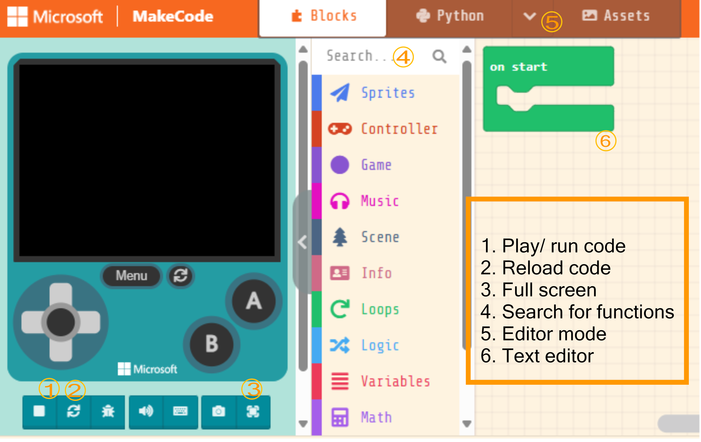

. Navigate to <https://arcade.makecode.com/>
. https://arcade.makecode.com/identity/sign-in[Sign in], if possible. +
This step is not required.  If you do log in, your code will be automatically saved. Log in using your https://account.microsoft.com/account[Microsoft Account] or https://support.google.com/accounts/answer/14152768[Google Account], or by using https://support.clever.com/hc/s/articles/360026162691?language=en_US[Clever].
. Create a new project.
. The MakeCode Editor will look like the image below.
+

