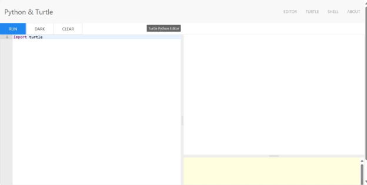

= Learn to Code with Python Turtle Mode: Pong
:source-highlighter: highlight.js

== Setup

1. Navigate to <https://trinket.io/turtle>.
2. Delete all the code except for the first line `from turtle import *`
 

TIP: Documentation for turtle package is at <https://docs.python.org/3/library/turtle.html>.

== Lesson 1: The Screen

Today we're using the Turtle module available in Python.  It's a quick way to create graphical shapes using the Python programming language.  Much of our code will start with `turtle` since that is the name of the module.

We're going to make a simple game where you have to "bounce" a ball around the screen. To do this, we're going to use the Screen object. Let's start with a really simple program. 

[source,python]
----
turtle.Screen()bgcolor("darkblue")
----

Click the RUN button at the top.  What does it do?

Before we go on, you should know a little bit about the `Screen` object.  Python Turtle uses coordinates to figure out where things go.  Like the Cartesian Plane you are used to in Algerbra, `0,0` is the coordinate in the center of the screen.

[%noheader, grid=none, frame=none, %autowidth, cols="1%m,99%a"]
|===
.2+>.^| X  
| image::Images/PythonTurtle-Screen.svg[align="center"]
^m| Y
|===

[%header, %autowidth, cols="a,m,m"]
|===
| Shape | X-coordinate | Y-coordinate
| Black dot | 0 | 0 
| Red circle | -turtle.window_width()/2 |  turtle.window_height()/2 
| Orange triangle | turtle.window_width()/2 |  turtle.window_height()/2 
| Green square | -turtle.window_width()/2 |  -turtle.window_height()/2 
| Blue star| turtle.window_width()/2 |  -turtle.window_height()/2 
|===

TIP: The Python Turtle coordinate system is different from most other graphic libraries.  Usually the upper-left corner of the screen is `(0,0)`.  The x-coordinate number increases as you move to the right.  The y-coordinate number increases as you go down.